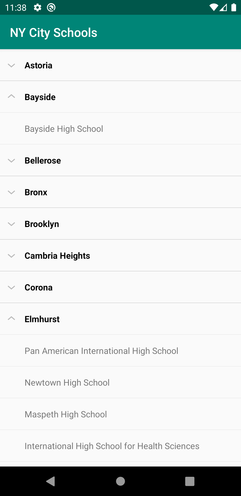

# City Schools - Android App

This is a sample Android project which displays *City of New York Schools* in an **expandable list view**. The app is developed in Kotlin with retrofit and dagger 2. This code can be used as a starter app for building something similar.

Here is the endpoint url which returns list of NY schools as json format:
https://data.cityofnewyork.us/resource/97mf-9njv.json

## Screenshot

